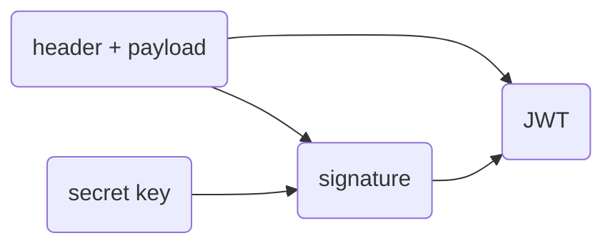
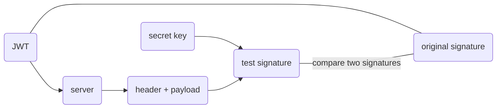
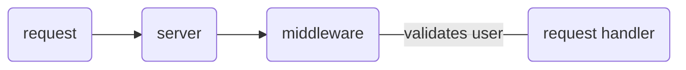
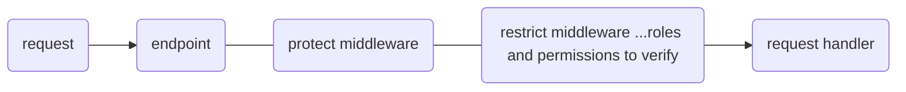

# authentication

table of content

- [authentication](#authentication)
  - [manage password](#manage-password)
  - [json web tokens (JWT)](#json-web-tokens-jwt)
    - [login workflow](#login-workflow)
    - [JWT structure](#jwt-structure)
    - [signing](#signing)
    - [verifying](#verifying)
  - [instance methods](#instance-methods)
  - [protecting routes](#protecting-routes)
  - [user authorization](#user-authorization)

## manage password

validate password and encrypt it. check confirm password.

encrypt passwords in Models and not in controllers: **fat models thin controllers**

use mongoose middleware to encrypt password.

We only encrypt passwords when the user has updated them or created them. We don't want to encrypt passwords when, for example, a user has updated his/her email.

```js
schema.pre("save", function (next) {
  if (!this.isModified("password")) return next();
});
```

---

## json web tokens (JWT)

### login workflow

1. user (client) sends POST request to the `/login` end point with user data
2. server checks if user exists and validates password
3. if true, it creates **unique JWT** using a **secret string** stored on the server
4. server sends back the generated JWT to the client
5. client saves the JWT neither in cookie or session.
6. **now user is logged in**

now client can send its JWT along the request to the protected routes.
server validates its JWT and then allows the access

### JWT structure

is a long string witch includes three parts

- **Header** : `encoded` metadata about the token, algorithm and token type
- **Payload** : `encoded` data. can be anything
- **verify signature** : generated from header, payload and the secret key

### signing



### verifying



```any
if original signature === test signature => data has not been modified => authenticated
```

without the secret, no one will be able to manipulate the JWT data, because they cannot create a valid signature for the data

---

## instance methods

functions that is available on every model of a schema. `this` keyword refers to the current document. if a fields select property is set to false then its not going to be visible on the output

```js
schema.methods.methodName = () => ...
```

---

## protecting routes

we use middleware to check if a user is valid for the data



1. **check if token exists**

usually token will be sent in request `headers` like:

```json
{
  "headers": {
    "Authorization": "Bearer token"
  }
}
```

```js
  if (authorizationHeader && authorizationHeader.startsWith("Bearer"))
  ...
  if (!token) return Error(...)
```

2.  **verify token**

jwt will do this for us

```js
const decodedDate = jwt.verify(token, secret);
```

3. **check if user still exists**

```js
const user = User.findById(...)
```

4. **check if user changed password after token was issued**

```js
dateOfChangedPassword < dateOfTokenCreation;
```

---

## user authorization

checking if a user is allowed to access certain routs

