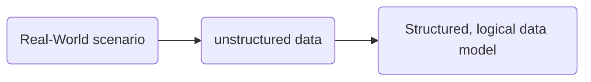
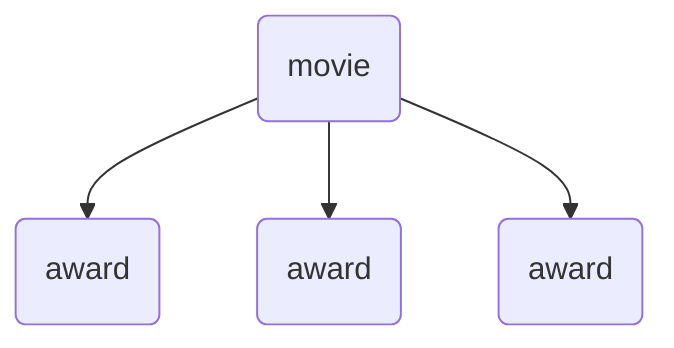
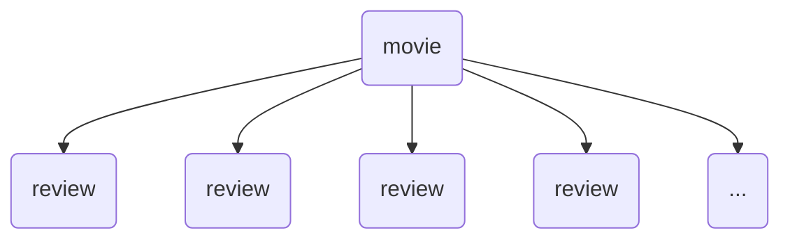
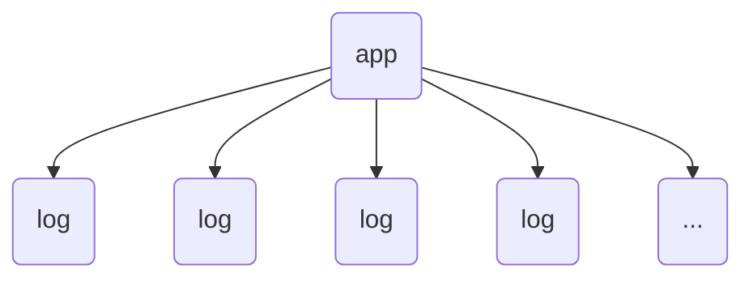
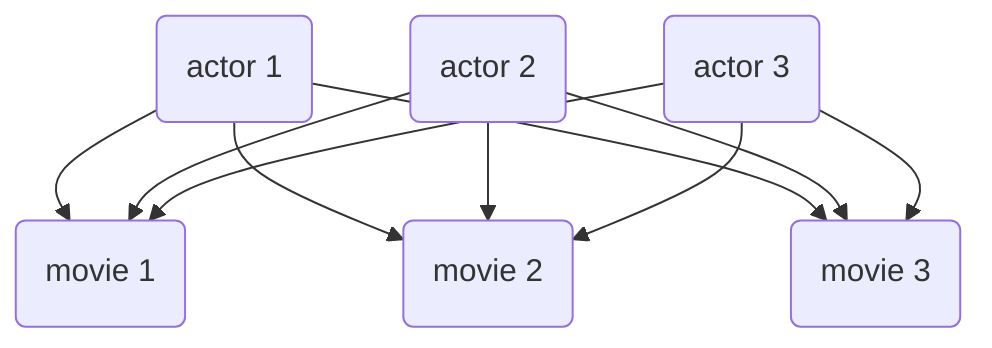
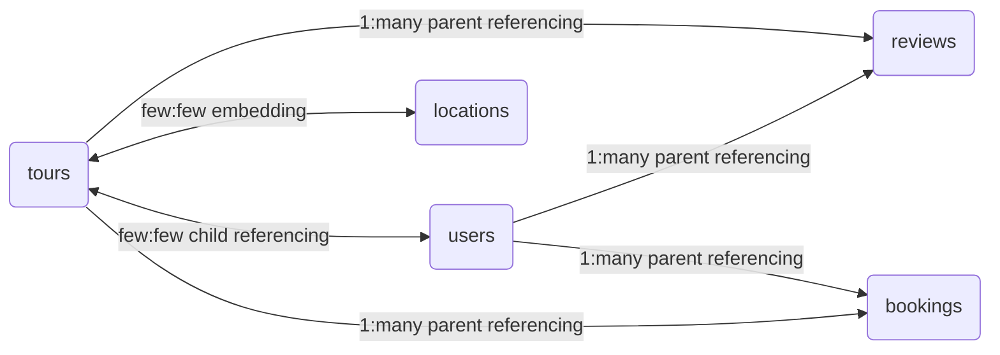

# Data modeling

- [Data modeling](#data-modeling)
  - [different types of **relationships**](#different-types-of-relationships)
    - [**1:1**](#11)
    - [1: many](#1-many)
      - [**1: few**](#1-few)
      - [**1: many**](#1-many-1)
      - [**1: ton**](#1-ton)
    - [many: many](#many-many)
  - [referencing vs embedding](#referencing-vs-embedding)
    - [reference/normalize](#referencenormalize)
    - [Embedded/denormalized](#embeddeddenormalized)
    - [which one to use](#which-one-to-use)
  - [types of referencing](#types-of-referencing)
    - [child referencing](#child-referencing)
    - [parent referencing](#parent-referencing)
    - [two-way referencing](#two-way-referencing)
  - [the naTours model](#the-natours-model)

the process of taking unstructured data generated from a real world scenario and structure it to a logical data model



1. different types of **relationships** between data
2. **Referencing**/normalization vs **embedding**/denormalization
3. choosing witch one to use
4. types of referencing

## different types of **relationships**

### **1:1**

when one field can only have one value


_one movie can only have one name_

---

### 1: many

#### **1: few**



_one movie can win many awards_

#### **1: many**



#### **1: ton**



_can grow to infinity_

---

### many: many



---

## referencing vs embedding

when there is connections between data there is two way to connect them

### reference/normalize

movie document

```json
{
    "_id": ObjectID("23493528"),
    "title": "Interstellar",
    "releasedYear": 2014,
    "actors":[
        ObjectID("555"),
        ObjectID("777")
    ]
}
```

actor document

```json
{
    "_id": ObjectID("555"),
    "name": "Matthew McConaughey",
    "age": 50
},
{
    "_id": ObjectID("777"),
    "name": "Anne Hathaway  ",
    "age": 37
}
```

### Embedded/denormalized

movie document

```json
{
    "_id": ObjectID("23493528"),
    "title": "Interstellar",
    "releasedYear": 2014,
    "actors":[
        {
            "name": "Matthew McConaughey",
            "age": 50
        },
        {
            "name": "Anne Hathaway  ",
            "age": 37
        }
    ]
}
```

### which one to use

| criteria                                                                         | embedding                                                             | referencing                                               |
| -------------------------------------------------------------------------------- | --------------------------------------------------------------------- | --------------------------------------------------------- |
| Relationship type <br>(how two datasets are <br>related to each other)           | 1:few<br>1:many                                                       | 1:many<br>1:ton<br>many:many                              |
| Data access pattern<br>(how often data is read <br>and written)                  | data is mostly read<br>data dose not change quickly<br>(more reading) | data is updated a lot<br>(more writing)                   |
| Data closeness <br>(how much the data <br>is related, how we want <br>to query ) | datasets are really close                                             | we frequently need to query<br>both datasets on their own |

## types of referencing

### child referencing

parent and children are toughener

- 1: few
- 1: many

parent document

```json
{
    ...,
    "childDocuments":[
        ObjectID("1111"),
        ObjectID("1222"),
        ObjectID("1333"),
        ObjectID("1444"),
        ObjectID("1555"),
    ]
}
```

child documents

```json
{
    "_id": ObjectID("1111"),
    ...
},
{
    "_id": ObjectID("1222"),
    ...
},
{
    "_id": ObjectID("1333"),
    ...
},
{
    "_id": ObjectID("1444"),
    ...
},
```

### parent referencing

in this case parent doesn't know any hing about children

- 1: many
- 1: ton

parent document

```json
{
    "_id": ObjectID("22"),
    ...
}
```

child documents

```json
{
    "parentId": ObjectID("22"),
    ...
},
{
    "parentId": ObjectID("22"),
    ...
},
{
    "parentId": ObjectID("22"),
    ...
},
{
    "parentId": ObjectID("22"),
    ...
},
```

### two-way referencing

- many: many

```json
{
    "_id": ObjectID("22"),
    "childDocuments":[
        ObjectID("1111"),
        ObjectID("1222"),
        ObjectID("1333"),
        ObjectID("1444"),
        ObjectID("1555"),
    ],
    ...
}
```

child documents

```json
{
    "parentId": ObjectID("22"),
    "_id": ObjectID("1111"),
    ...
},
{
    "parentId": ObjectID("22"),
    "_id": ObjectID("1222"),
    ...
},
{
    "parentId": ObjectID("22"),
    "_id": ObjectID("1333"),
    ...
},
{
    "parentId": ObjectID("22"),
    "_id": ObjectID("1444"),
    ...
},
```

## the naTours model


